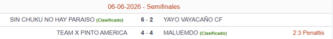
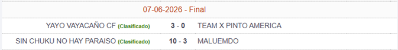
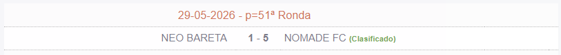
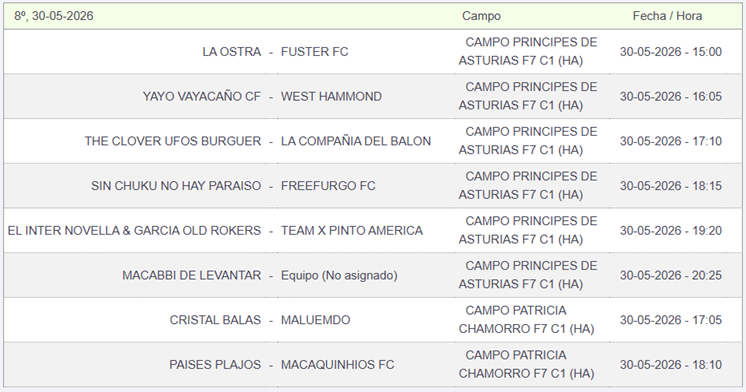
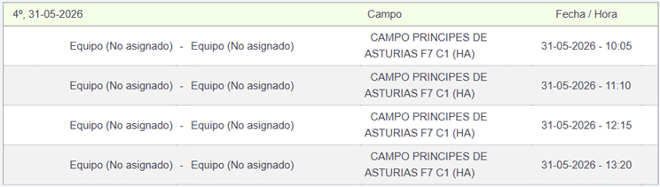

<table style=" border: inset 0pt">
  <tr style="text-align: left; border: inset 0pt">
    <td style="text-align: left; border: inset 0pt">
      <select onchange="window.location.href=this.value">  
        <option value="../../../Temporadas/2025-2026/Copa/index_Copa.html">25-26 Copa</option>
        <option value="../../../Temporadas/2025-2026/Div_1/index_Div_1.html">25-26 1ª Div</option>
        <option value="../../../Temporadas/2025-2026/Div_2/index_Div_2.html">25-26 2ª Div</option>
        <option value="../../../index.html">25-26 3ª Div</option>
        <option value="../../../Temporadas/2025-2026/Div_4/index_Div_4.html">25-26 4ª Div</option>
      </select>
    </td>
  </tr>
</table>
 

<!--# PARTIDOS

  
  

-->

# RESULTADOS

  
  
  
  
  

