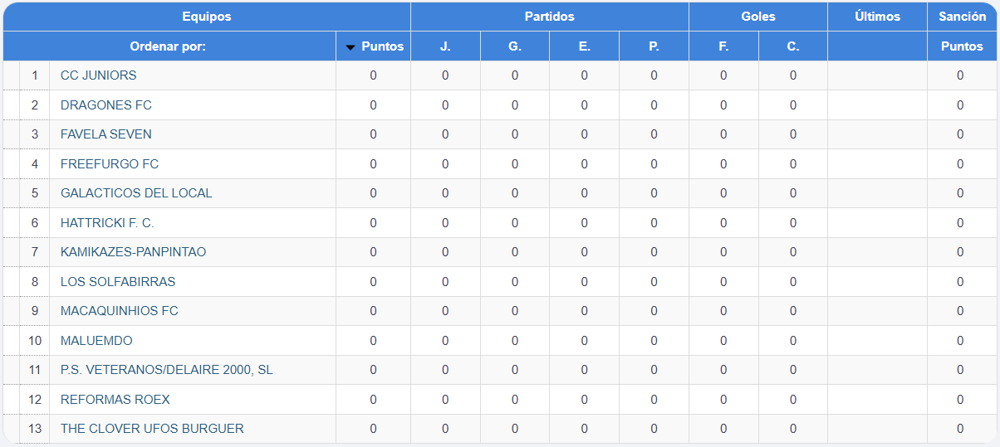
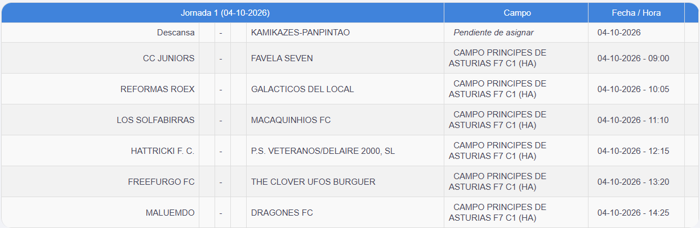

<table style=" border: inset 0pt">
  <tr style="text-align: left; border: inset 0pt">
    <td style="text-align: left; border: inset 0pt">
        

    </td>
    <td style="text-align: left; border: inset 0pt">
      <a href="../../../Temporadas/2026-2027/Div_2/equipaciones_2026-2027.html">Equipaciones 3ª Div Futbol 7 25-26</a>
    </td>
  </tr>
</table>

  
 

# CLASIFICACIÓN

  

<a href="../../../Temporadas/2026-2027/Div_2/goleadores_2026-2027.html">Goleadores</a>

# PRÓX.PARTIDOS

  
  
  
  
  
  
  
  
  
  
  
  
  
  
  
  
  
  
  
  
  
  
  
  
  
  

# RESULTADOS

  
  
  
  
  
  
  
  
  
  
  
  
  
  
  
  
  
  
  
  
  
  
  
  
  
  

